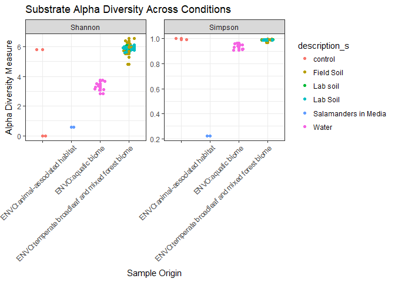

Final Report: Microbiome Stability of Red-Backed Salamanders
================
Allison Bogisich
November 27, 2017

Introduction
============

Bacterial communities which are host-associated have the potential to impact host health in many species. This is true across taxa, including- but not limited to- humans (Fierer *et al.*, 2012), corals (Rosenberg *et al.*, 2007), insects (Dillon *et al.*, 2005), and amphibians (Harris *et al.*, 2009). Skin-associated bacteria of amphibians are increasingly being recognized for their defensive role against pathogens, but we still have a very narrow understanding of their basic ecological functions. The cutaneous epidermal layer itself provides a barrier against pathogens, but it is the microbial communities that reside on the skin itself which provides a better defense. Particularly of concern to herpetologists is the pathogenic fungus *Batrachochytrium dendrobatidis* (Bd), which some symbiotic cutaneous-microbacteria appear to repel (Lam *et al.*, 2010,Woodhams *et al.* (2007)). Bd is what causes the fungal disease chytridiomycosis, which has been a contributing factor in bringing many amphibian populations to near extinction within the past decade (Skerratt *et al.*, 2007, Crawford *et al.* (2010)).

Amphibians are well adapted to a semi-terrestrial life, because their skin is covered by mucous produced by numerous glands located over their entire body. These glandular secretions help protect the skin from mechanical trauma (such as abrasions), limits entry of pathogens via antimicrobial chemicals, and helps facilitate osmoregulation which occurs through the skin. Proper osmoregulation, which is centralized on an amphibians ventral 'drink patch', helps to maintain a proper salt and water balance within the internal organs when the amphibian is in water or on land (Dubaissi and Papalopulu, 2011). The antimicrobial compounds are components of an amphibian's innate immune response and defend amphibians against bacterial and fungal infections. Amphibians regularly undergo skin shedding which regulates populations of skin microorganisms and ensures the continued integrity of their skin surface (Cramp *et al.*, 2014). Unlike other vertebrates, in which skin cells are cast off either individually or in small patches, amphibians undergo a more cyclical molting process whereby an entire layer of skin is removed during every episode of shedding. Each time the skin microbiome population becomes reduced and returns to a lower level of diversity. Once separated, the outer stratum of the skin is lost to the environment, or in most cases is ingested by the organism in an attempt to reabsorb critical nutrients or parts of its own microbiome via digestion. According to Cramp, risks of microbial imbalance occurring post-molt on the skin are reduced in this manner. Since the vast majority of amphibians consume their own skin, it is possible that an integral cycle is established between the organism's skin and their respective gut microbiome.

When operating optimally, the immune system-microbiota symbiosis combines the innate and adaptive branches of immunity in amphibians, enabling the system to better select for and calibrate adaptive immune responses and terminate maladaptive ones (Belkaid and Hand, 2014). However, once an amphibian becomes infected with Bd, the fungus spreads and grows over the drink patch, clogging the pores of skin through which osmoregulation and respiration would normally take place. Consequentially, the organism effectively loses it's ability to maintain homeostasis and it's immune system becomes increasingly compromised, allowing Bd to garner more nutrients from the host for its own pathogenic life-cycle. Already commonly facing other threats such as climate change and habitat encroachment, infection with Bd can become a critical hit to an already endangered species. However, some species of amphibians such as the red-backed salamander, *Plethodon cinereus*, appear to have established symbiotic microbial communities which are providing another line of defense against infectious pathogens sharing a common host (Bataille *et al.*, 2016, Harris *et al.* (2009)). While the microbiome of such species are resistant to pathogenic infection by Bd, it remains unclear as to why Bd can disrupt the microbiome of more susceptible species. Some researchers estimate that certain bacteria a simply better at out-competing Bd for their respective epidermal niches. Documented instances of such relationships during naturally occurring Bd outbreaks are few, and identifying causation from field observations often proves difficult. In this post-experimental work using Loudon et al.'s data from surveying the microbiome of *P. cinereus* (Loudon *et al.*, 2014), instead of reporting on the most prevalent and abundant OTUs, I will be investigating the relationship between the microbial makeup which was found on the salamanders and the microbial community in the medium upon which they were residing. Acquiring more data which supports the importance of bacterial soil reservoirs for maintaining a hosts’ microbial community could have a direct effect on amphibian conservation practices. Conservation research-especially when pathogens are involved- is frequently conducted in a laboratory setting with critically endangered species taken into survival assurance colonies in captivity. Unfortunately, this removes them from their natural environment and places them in a setting that typically lacks similar environmental bacterial reservoirs due to standard laboratory hygienics. This could greatly affect the structure of their microbiome, both in diversity and functionality and consequentially could skew experimental tests of their immune response. Currently, removal of amphibians from their natural environment may likely be a major disturbance for their microbiota and may further limit the capacity for the microbiota to defend against pathogens. I would hypothesize that the microbial communities on the salamanders will have a markedly different diversity profile from that of the medium upon which they reside. Additionally, as the salamanders were tested over a period of time, I will be examining the stability of their microbiomes over time. I'd predict that while the numerical quantities of the most present bacterial classes will change, that the relative amounts and ranking of classes will remain nearly constant over time. It would be adaptively advantageous to maintain the stability of one's Bd-defensive microbiome, as lapses or large fluctuations in resistance would leave the organism more susceptible to infection. As some amphibians’ microbiota are capable of excreting anti-fungal metabolites, the stability of the microbiota may be indicative of the health of the organism (Loudon *et al.*, 2014). This analysis will report which of the microbiota were most stable despite changes in external (environment and time) and internal (molting) conditions, as they may be the key to preventing more extinctions and reducing the spread of Bd. Potentially, the results of this analysis may help elucidate whether it is potentially more harmful for a species facing pathogens in their natural habitat to to be brought into the 'safety' of a lab colony if they are not supplied with a natural bacterial reservoir. Based on the evolutionary development of anti-biotic resistant bacteria in relatively sterile hospital conditions, the salamanders kept on sterile media could be in a less microbially advantageous position. For when they undergo molting, they will not be able to recuperate any of their epidermal microbiota from their surroundings and instead have to rely solely on consumption and reabsorption from shed skin.

Methods
=======

Study design
------------

*P. cinereus* is present in relative abundance in the Shenandoah mountain region of Virginia. While they are in close contact with soil in their natural habitat, they are known to easily tolerate much more sterile laboratory conditions. Loudon et al. tested both salamanders and soil samples at respective collection sites to determine whether a natural soil bacterial reservoir was necessary in order to maintain the stability and diversity of host bacterial communities in the epidermal microbiome of *P. cinereus*. Previously, this had not been tested over time, so Loudon and his team sampled salamanders in the field and again after captive-housing in a laboratory with or without having been provided a bacterial reservoir in their enclosure. After field sampling, salamanders were housed either with soil from the field or with sterile Provasoli media. Thereafter, they measured using both alpha and beta diversity using culture independent Illumina 16S rRNA gene sequencing to determine the diversity of bacterial organizational taxonomic units (OTUs) on each salamander and the relative microbial diversity between salamanders. Additionally, tests for the effectiveness of perturbations on shifting the stable core community were conducted on the collected specimens. Lastly, Loudon and his team tested whether the predicted anti-fungal functionality of the core community microbacteria was significantly distinct from the functions of the more peripheral microbial community members. Their main goal was to determine how removal from a natural environment may affect their disease susceptibility in the laboratory or in the wild following releases of assurance colony bred amphibians.

Sample origin and sequencing
----------------------------

Salamanders were collected by Loudon and his team from the George Washington National Forest of the aforementioned mountain range in October of 2011 (VADGIF Permit No. 047519), and the soil in this experiment was sampled at the same location and time. After gloved capture in the field, the salamanders were rinsed three times with sterile media to remove and transient bacteria present on the specimen. In order to collect data on the immediate microbial environment, each salamander was quickly swabbed using ten strokes back and forth with a sterile rayon swab to collect data on the immediate microbial environment. They were swabbed on either their left or right ventral surface, side chosen at random. Swab samples were then stored on ice in the field and then frozen at negative eighty degrees Celsius prior to DNA extraction. The collected salamanders were placed into sterile 50-mL falcon tubes, and the soil samples were transported in plastic autoclaved containers. The salamanders were then housed individually and randomly assigned to one of two experimental conditions designed to test whether the bacterial reservoir affects the composition and stability of the specimen's microbiome. Ten were assigned to live on sterile media in their containers, while the other ten in the soil treatment group lived on homogenized soil from the salamander's natural habitat. Initial soil samples were taken in triplicate prior to being deposited into the containers in order to identify bacterial communities. The salamanders were swabbed every seven days for 28 days, and 'sterile media' was changed every seven days post-swabbing. Soil media was not replaced. Soil was sampled in triplicate every fourteen days for the soil treatment group. Every salamander was fed 15 fruit flies each week post-sampling, although the bacteria from the flies did not reportedly contribute significantly to the microbial community given the bacterial biomass in the soil. Salamander and soil DNA extractions and 16S rRNA amplifications were performed with the addition of primers, and sequenced on an Illumina HiSeq 2000. One aliquot of DNA was also used to test each salamander for the presence of Bd. These data can be found in the Quantitative Insights Into Microbial Ecology (QIIME) database \[here\] (www.microbio.me/qiime; study no. 1618) or in the European Bioinformatics Institute (EBI) archive with the accession number ERP003771. Amplicons were sequenced using a third of an Illumina HiSeq lane at the University of Colorado at Boulder, yielding short 100-bp reads. Quantitative Insights Into Microbial Ecology (QIIME) version 1.5.0 (Caporaso *et al.*, 2010) was used for all subsequent sequence analysis, unless otherwise noted by Loudon et al.. Sequences were filtered for quality and assigned to their respective sample using the default settings of QIME by Loudon and his team.

Computational
-------------

These are the methods you used to do your bioinformatic analyses. Should probably be between 0.5 and 1 pages. At a very minimum should include citations for DADA2 and phyloseq if you are doing an amplicon study, or other citations as appropriate.

Post DNA extraction from the samples, sequences were downloaded from NCBI's SRA Run Selector \[here\] (<https://www.ncbi.nlm.nih.gov/Traces/study/?acc=ERP003771>) via a bash script for-loop to acquire all necessary metadata from each run from the pre-formatted SRA run table. The sequences were then trimmed and run through a DADA2 pipeline using an R script. Primary packages used to clean and analyze the data were installed via bio conductor and devtools. The DADA2 package (Callahan *et al.*, 2016) was installed for use in conducting fast and accurate sample inferences from amplicon data with single-nucleotide resolution, and to `ploterrors` and `plotQualityProfile`. Seqinr was used to export fastas of our final de-noised variants. Mctoolsr, which stands for “microbial community analysis tools in R”, was used to more efficiently manipulate data and perform certain analyses common to microbial community studies, while allowing us to easily access data using established functions (<https://github.com/leffj/mctoolsr/>). The 'ggplot2' package could then be used for visualization of data into graphic results (Wickham, 2016). 'Phyloseq' (McMurdie and Holmes, 2013) was the final package installed for my pipeline in order to visualize my results using tools `plot_bar`, `plot_richness`.

Raw data were sorted for order and samples were extracted with their appropriate naming system, using the 'tidyr' package for proper formatting. Quality checks were run prior to any data visualization to ensure that the lengths of the sequences being used were of proper length for obtaining quality scores above 30, which required filtering and trimming all sequences. Error models were also created to analyze each sample individually, and then were visualized by plotting. Duplicated sequences and chimeras were also removed from the data set, so as not to compound error. Sequences were removed if shorter than 55 bp or larger than 155 bp in length, had a quality score lower than 25, had ambiguous characters or uncorrectable barcodes, or if it did not contain the primer sequence. Only one sample- ERR325545- from the Loudon et al. study was removed due to quality issues. Once all the data was filtered, QC checked and trimmed, they were constructed into a phyloseq object. The phyloseq object was then used loaded into my .Rmd to be able to run all the code and extract the smaller sub-sets of the data I wanted to analyze. I then used the aforementioned phyloseq and ggplot2 packages to manipulate the data and create graphs and tables. The amplicon metadata output process from this analysis can be found in a Github repository in a `scripts` directory available \[here\] (<https://github.com/2017-usfca-cs-640/ABogisich-final-project>).

Results
=======

``` r
# There are many many genes in this dataset, so we can
# subset it down to just a few here to look for interesting patterns
# in the most highly expressed
# alpha diversity metrics, create subset
salamander_subset_obj <- subset_samples(phyloseq_obj,
                                    Organism_s != "soil metagenome")
# plot alpha diversity of mucus samples
plot_richness(salamander_subset_obj,
                x = "env_biome_s",
                measures = c("Shannon", "Simpson"),
                color = "description_s") +
    xlab("Sample Origin") +
    geom_jitter(width = 0.2) +
    theme_bw() +
    ggtitle(" Salamander Micriobiota Alpha Diversity Across Substrates") +
    theme(axis.text.x = element_text(angle = 45, vjust = 1, hjust = 1))
```


**Figure 1**: Alpha diversity measure of the bacterial community diversity on individual salamanders.

By using the Shannon and Simpson diversity indexes, I have plotted the mean microbial species diversity in samples at the level of an individual salamander. This also includes sampling from a control environment in which we'd expect to see no diversity as well as water samples that were collected from salamanders which were initially taken from an aquatic habitat in the field. The green data points indicate samples from salamanders in the sterile media treatment group that were without a bacterial reservoir in the lab. The teal points are from samples taken from salamanders which were provided with soil and its associated bacterial reservoir from their natural habitat. Some of the control samples appear to have a high amount of diversity while others have none in the Shannon index, but all display alpha diversity in the Simpson index. The alpha diversity distribution among salamander samples appears to be fairly heterogeneous. In both treatment groups there were samples that had low and high diversity measures across both indexes. For the aquatic biome sampling, the alpha diversity remained relatively high across both indexes.



**Figure 2**: Alpha diversity measure of the bacterial community diversity across substrate media.

The breakdown of the alpha diversity of substrate sampling looks a little bit different from that of the salamander alpha diversity. Similarly we can see that the controls for substrate also had contaminants and exhibited a measure of diversity. Lab soils were broken down into two separate descriptions due to an typo during the cataloging of the data with the lack of capitalization of the "s" in "soil". However, we can still see that the alpha diversity of the lab soils from the treatment group with the bacterial reservoir did indeed have higher alpha diversity than that of the non-reservoir treatment group of salamanders in media. Both the field and lab soils had almost six times as much bacterial alpha diversity relative to the sterile media in the Shannon index, and 0.5 times as much according to the Simpson index. The water tested from the aquatic biome fell in the middle of distribution for alpha diversity in the Shannon index, with greater diversity than the sterile media but less than the field lab tested soils. In the Simpson index, the difference in alpha diversity between water and soils is less pronounced.

| Phylum          | Class               |  sum\_count|
|:----------------|:--------------------|-----------:|
| NA              | NA                  |     3709937|
| Proteobacteria  | Alphaproteobacteria |     3308525|
| Acidobacteria   | Acidobacteria\_Gp1  |     2604731|
| Acidobacteria   | Acidobacteria\_Gp2  |     1998973|
| Proteobacteria  | Gammaproteobacteria |     1607474|
| Proteobacteria  | Betaproteobacteria  |     1449166|
| Proteobacteria  | NA                  |     1242273|
| Bacteroidetes   | Sphingobacteriia    |     1123785|
| Actinobacteria  | Actinobacteria      |     1032673|
| Acidobacteria   | Acidobacteria\_Gp3  |      855919|
| Planctomycetes  | Planctomycetia      |      696378|
| Verrucomicrobia | Spartobacteria      |      523161|
| Verrucomicrobia | Subdivision3        |      398885|
| Bacteroidetes   | Flavobacteriia      |      291026|
| Proteobacteria  | Deltaproteobacteria |      248445|

**Table 1**: The top 15 most abundant bacteria across all salamander and substrate samples.

While the most abundant sequence identified did not have a matching known bacterial sequence, the rest of the top fourteen display the most common bacterial phylum and associated classes. These were the most prolific taxa across both sampled skin swabs from salamanders and also from sampled substrates. The most common phyla were Proteobacteria which took five of the fifteen spots for greatest abundance. Actino- and Acidobacterium were also well represented with 1:3 respectively. Bacteriodetes and Verrucomicrobia were the remaining phyla represented. The most common classes for the respective phyla did not show much of a trend, although there were three taxonomic groupings of the class Acidobacteria which were prominent.


**Figure 3**: Presence of microbial classes on salamanders over time in both experimental conditions.

In order to compare the microbial communities found on the salamanders over a period of four weeks, I broke it down by representative classes. For the salamanders in the media treatment, the majority of the classes of bacteria present during the initial collection were still present on the sampled salamanders even almost month later in sterile conditions. Gammaproteobacteria, Sphingobacteriia, and Actinobacteria were the core community. The greatest variety of bacterial classes were found on the initial day of sampling. In the soil treated salamanders, there also appears to be the most class diversity on the day of collection. However, by day 28 only one sequence matched type of bacteria remained- Acidobacteria\_Grp2. The sum count for the bacteria taxa were quite small overall for both experimental groups of salamanders.


**Figure 4**: Presence of microbial classes over time in soil.

When analyzing the relative amounts of bacterial classes present in the soil tested over time, there are much larger summation values for the classes. Counts ranged anywhere from 13,000 at the lowest to nearly a million at the highest for soil samples. While the field soil distribution had quite a large diversity of microbial classes (seven identified), samples from day zero in the lab dropped down to just one class- Acidobactera\_Grp2. However, then when sampled in the subsequent weeks the soil regained a great deal of microbial diversity which persisted till the end of the study. Weeks two and four had samples that both exhibited essentially equivalent amounts of the ten identified classes present. Acidobactera\_Grp2 and Grp1 consistently exhibited the greatest abundance in the sampled soils once in the laboratory setting.

Discussion
==========

Microbiota often perform a number of important functions for their hosts, such as disease resistance (Dillon *et al.*, 2005; Rosenberg *et al.*, 2007; Harris *et al.*, 2009; Becker and Harris, 2010), metabolism, vitamin production, development and activity of the immune system and influencing behavior (Turnbaugh *et al.*, 2007). For this study, I examined the bacterial community dynamics on nine healthy, red-backed salamanders that were not infected with Bd, and one which had a minor case of infection. It is likely that the stability and diversity of host microbiota correlate to the consistency and quality of protection against pathogens. In both the soil and the sterile media treatments, the community composition of the salamander skin microbiota changed when brought into the laboratory. Indexes used for testing the alpha diversity of bacteria on the salamanders both were indicative of similar quantities of diversity across both time and experimental substrate (Fig. 1). This suggests that regardless of whether the salamanders were housed with a bacterial reservoir or not, the amounts of alpha diversity remained relatively the same between organisms in the two conditions. However, there were some larger clustering of alpha diversity for salamanders in soil in the upper half of each diversity index, and conversely more clustering of salamanders in media in the lower half of each index. While there was no consistent trend in each condition, the data does reliably show that the microbiomes of salamanders in soil generally had great microbiotic diversity than media dwelling salamanders. The aquatic biome samples contained a median level of alpha diversity according to the Shannon index, which corresponds well to be being neither a sterile environment nor as suitable a habitat for bacteria as soil.

When the substrate types were tested and compared over time, the results were much more conclusive since the data points clustered tightly (Fig. 2). The soils tested in the field had the greatest range of alpha diversity of all substrates tested, which is likely indicative of the essentially random nature of selecting whichever plots had a salamander to collect. Laboratory condition soil samples clustered very tightly in level of diversity. This is likely due to the diversity limiting factor of containment, where there could be only minimal flow of additional bacterial species into the containers housing the salamanders. Diversity of the sterile media remained very low across time as should be expected. Sterile media was replaced after each sample was taken over the course of the experiment. Any bacterial diversity on the sterile media either resulted from ambient bacteria or came from the microbiome of the salamanders. Gammaproteobacteria, Sphingobacteriia, and Actinobacteria were the bacterial classes whose presence remained nearly constant over time (Fig. 3). These resulting classes support my hypothesis that the core microbial community members of the salamanders would remain relatively stable over time, since each of these three classes were accounted for in the top nine of fifteen bacterial classes ranked by sum count across all samples (Table 1). While they were not the bacterial classes with the absolute greatest abundance, they were present in great enough quantities to maintain a stable epidermal niche on their host. Sphingobacteriia in particular are capable of producing sphingolipids, which are compounds that can play important roles in signal transmission and cell recognition (Bergey, 2001). Sphingolipidoses, or disorders of sphingolipid metabolism, have particular impact on neural tissue. While Actinobacteria, especially *Streptomyces spp.*, are known producers of many useful bio-active metabolites such as antibacterials, antifungals, antivirals, immunomodifiers, and enzyme inhibitors (Gupte *et al.*, 2002). These two bacterial classes in conjunction could be supplying their amphibian hosts with greatly improved immunity and resistance to fungal pathogens such as Bd.

Alpha diversity remained relatively stable over the course of the experiment for salamanders housed in the presence of a soil bacterial reservoir (Fig.3). These results support my hypothesis that relatively minor disturbances- such as natural rates of skin sloughing- which occurred during the experiment in the laboratory, are not greatly reducing the host's diversity if a bacterial reservoir is available (Meyer *et al.*, 2012). There was little correlation between alpha diversity of salamanders’ skin microbiota and the microbiota of the salamanders’ immediate habitat upon capture in the field nor over the duration of lab sampling (Fig. 3 and Fig. 4).Thus, even though their microbes are environmentally derived, salamander skin communities are not determined solely by passive inoculation. This is supportive of my prediction that in the host species, there may be increased selection for microbes that are generally in low abundance in the soil environment. Our results suggest that host factors appear to be selected for and maintained at similar relative abundance over time. The same pattern has been found in other amphibians, and may occur even in amphibian larvae (Walke *et al.*, 2014). Cumulatively, the results indicate that removing some species which already exhibit resistance to fungal pathogens will likely not compromise their microbially supported defenses. More study will need to be conducted with species which are naturally more susceptible to fungal pathogens like Bd, in order to compare the diversity and stability of their skin symbiont community. It could also prove beneficial to increase the period of time over which sampling occurs in order to see if the bacterial makeup on their skin remains stable after longer than twenty-eight days. Alternatively, re-releasing tagged captive salamanders and then monitoring their microbiomes could potentially improve methods of captive assurance colony husbandry.

Amphibian skin has been found to contain natural substances that could be the basis for a powerful new genre of antibiotics. One substance that has been isolated from the skin secretions of the Foothill Yellow-legged Frog — a species once common throughout the mountainous regions in California and Oregon, but which are now facing extinction — shows promise for killing antibiotic-resistant *Staphylococcus aureus* (MRSA) bacteria. MRSA is more commonly called a “superbug,” and has become infamous for causing deadly outbreaks of infection among already hospitalized patients. Now that outbreaks have begun occurring in settings outside of hospitals, including schools, nursing homes, and day care centers, concern has been mounting about how to best combat the pathogen (Conlon *et al.*, 2014). Amphibians could become allies in humanity’s battle with antibiotic-resistant infections which currently threaten millions of people worldwide. Since their taxonomic class has been around for nearly 300 million years, there has been plenty of time for their immune systems to develop natural defenses against disease-causing microbes in the environment. Their natural environments now include polluted waterways where strong microbially induced defenses against pathogens could have make symbioses with bacteria even more critical to their survival (Colombo *et al.*, 2015). More research will need to be conducted on the microbial symbioses that exist in amphibian microbiomes in order to determine molecular pathways and mechanisms. Already, all-D-enantiomers in frog skin derivatives have been found to be fully active against fungi and other gram-positive bacteria, suggesting that more than one mechanism accounts for the antimicrobial activity of this peptide (Fehlbaum *et al.*, 1996). Establishing more known patterns in the skin microbiota of wild and captive amphibians- and the environmental factors which underlie them- will be necessary to better understand skin symbiont community assembly, and ultimately, the role skin microbiota play in a host's phenotype including disease resistance.

Sources Cited
=============

Bataille,A. *et al.* (2016) Microbiome variation across amphibian skin regions: Implications for chytridiomycosis mitigation efforts. *Microbial ecology*, **71**, 221–232.

Becker,M.H. and Harris,R.N. (2010) Cutaneous bacteria of the redback salamander prevent morbidity associated with a lethal disease. *PloS one*, **5**, e10957.

Belkaid,Y. and Hand,T.W. (2014) Role of the microbiota in immunity and inflammation. *Cell*, **157**, 121–141.

Bergey (2001) Bergey’s manual of systematic bacteriology. **1**, 465–466.

Callahan,B.J. *et al.* (2016) DADA2: High-resolution sample inference from illumina amplicon data. *Nature methods*, **13**, 581–583.

Caporaso,J.G. *et al.* (2010) QIIME allows analysis of high-throughput community sequencing data. *Nature methods*, **7**, 335–336.

Colombo,B.M. *et al.* (2015) Microbiota and mucosal immunity in amphibians. *Frontiers in immunology*, **6**.

Conlon,J.M. *et al.* (2014) Potential therapeutic applications of multifunctional host-defense peptides from frog skin as anti-cancer, anti-viral, immunomodulatory, and anti-diabetic agents. *Peptides*, **57**, 67–77.

Cramp,R.L. *et al.* (2014) First line of defence: The role of sloughing in the regulation of cutaneous microbes in frogs. *Conservation physiology*, **2**.

Crawford,A.J. *et al.* (2010) Epidemic disease decimates amphibian abundance, species diversity, and evolutionary history in the highlands of central panama. *Proceedings of the National Academy of Sciences*, **107**, 13777–13782.

Dillon,R. *et al.* (2005) Diversity of locust gut bacteria protects against pathogen invasion. *Ecology Letters*, **8**, 1291–1298.

Dubaissi,E. and Papalopulu,N. (2011) Embryonic frog epidermis: A model for the study of cell-cell interactions in the development of mucociliary disease. *Disease models & mechanisms*, **4**, 179–192.

Fehlbaum,P. *et al.* (1996) Structure-activity analysis of thanatin, a 21-residue inducible insect defense peptide with sequence homology to frog skin antimicrobial peptides. *Proceedings of the National Academy of Sciences*, **93**, 1221–1225.

Fierer,N. *et al.* (2012) Cross-biome metagenomic analyses of soil microbial communities and their functional attributes. *Proceedings of the National Academy of Sciences*, **109**, 21390–21395.

Gupte,M. *et al.* (2002) Antifungal antibiotics. *Applied microbiology and biotechnology*, **58**, 46.

Harris,R.N. *et al.* (2009) Skin microbes on frogs prevent morbidity and mortality caused by a lethal skin fungus. *The ISME journal*, **3**, 818–824.

Lam,B.A. *et al.* (2010) Proportion of individuals with anti-batrachochytrium dendrobatidis skin bacteria is associated with population persistence in the frog rana muscosa. *Biological Conservation*, **143**, 529–531.

Loudon,A.H. *et al.* (2014) Microbial community dynamics and effect of environmental microbial reservoirs on red-backed salamanders (plethodon cinereus). *The ISME journal*, **8**, 830–840.

McMurdie,P.J. and Holmes,S. (2013) Phyloseq: An r package for reproducible interactive analysis and graphics of microbiome census data. *PloS one*, **8**, e61217.

Meyer,E.A. *et al.* (2012) Changes in cutaneous microbial abundance with sloughing: Possible implications for infection and disease in amphibians. *Diseases of aquatic organisms*, **101**, 235–242.

Rosenberg,E. *et al.* (2007) The role of microorganisms in coral health, disease and evolution. *Nature Reviews Microbiology*, **5**, 355–362.

Skerratt,L.F. *et al.* (2007) Spread of chytridiomycosis has caused the rapid global decline and extinction of frogs. *EcoHealth*, **4**, 125.

Turnbaugh,P.J. *et al.* (2007) The human microbiome project: Exploring the microbial part of ourselves in a changing world. *Nature*, **449**, 804.

Walke,J.B. *et al.* (2014) Amphibian skin may select for rare environmental microbes. *The ISME journal*, **8**, 2207–2217.

Wickham,H. (2016) Ggplot2: Elegant graphics for data analysis Springer.

Woodhams,D.C. *et al.* (2007) Symbiotic bacteria contribute to innate immune defenses of the threatened mountain yellow-legged frog, rana muscosa. *Biological conservation*, **138**, 390–398.
