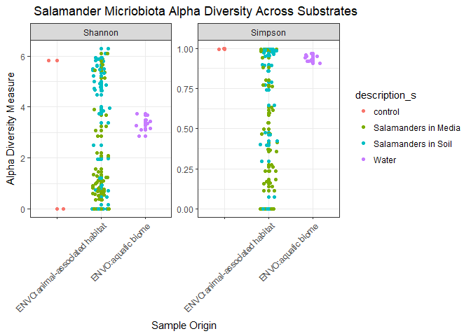
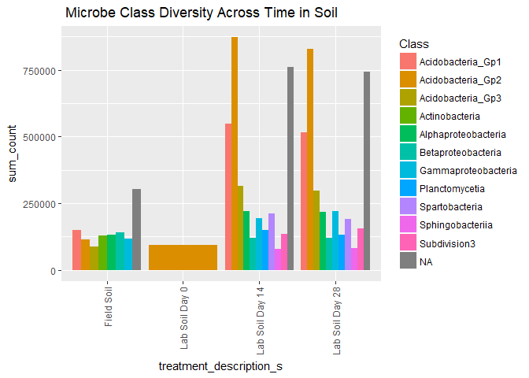

Final Report: Mirobiome Stability of Red-Backed Salamanders
================
Allison Bogisich
November 27, 2017

Introduction
============

Add about 2-3 pages here. Across the whole manuscript, you should cite at least 20 peer reviewed articles. One page is about 500 words.

Bacterial communities which are host-associated have the potential to impact host health in many species. This is true across taxa including- but not limited to- humans (Fierer *et al.*, 2012), corals (Rosenberg *et al.*, 2007), insects (Dillon *et al.*, 2005), and amphibians (Harris *et al.*, 2009). Skin-associated bacteria of amphibians are increasingly being recognized for their defensive role against pathogens, but we still have a very narrow understanding of their basic ecological functions. The cutaneous epidermal layer itself provides a barrier against pathogens, but it is the microbial communities that reside on the skin itself which provides a better defense. Particularly of concern to herpetologists is the pathogenic fungus *Batrachochytrium dendrobatidis* (Bd), which some symbiotic cutaneous-microbacteria appear to repell (Lam *et al.*, 2010,Woodhams *et al.* (2007)). Bd is what causes the fungal disease chytridiomycosis, which has been a contributing factor in bringing many amphibian populations to near extinction within the past decade (Skerratt *et al.*, 2007, Crawford *et al.* (2010)).

Amphibians are well adapted to a semi-terrestrial life, because their skin is covered by mucous produced by numerous glands located over their entire body. These glandular secretions help protect the skin from mechanical trauma (such as abrasions), limits entry of pathogens via antimicrobial chemicals, and helps faciliate osmoregulation which occurs through the skin. Proper osmoregulation, which is centralized on an amphibians ventral 'drink patch', helps to maintain a proper salt and water balance within the internal organs when the amphibian is in water or on land (Dubaissi and Papalopulu, 2011). The antimicrobial compounds are components of an amphibian's innate immune response and defend amphibians against bacterial and fungal infections. Amphibians regularly undergo skin shedding which regulates populations of skin microorganisms and ensures the continued integrity of their skin surface (Cramp *et al.*, 2014). Unlike other vertebrates, in which skin cells are cast off either individually or in small patches, amphibians undergo a more cyclical moulting process whereby an entire layer of skin is removed during every episode of shedding. Each time the skin microbiome population becomes reduced and returns to a lower level of diversity. Once separated, the outer stratum of the skin is lost to the environment, or in most cases is ingested by the organism in an attempt to reabsorb critical nutrients or parts of its own microbiome via digestion. Thus according to Cramp, risks of microbial imbalance post-molt on the skin are reduced. Since the vast majority of amphibians consume their own skin, it is possible that an integral cycle is established between the skin and the gut microbiome.

When operating optimally, the immune system-microbiota sybiosis combines the innate and adaptive branches of immunity in amphibians, enabling the system to better select for and calibrate adaptive immune responses and terminate maladaptive ones (Belkaid and Hand, 2014). However, once an amphibian becomes infected with Bd, the fungus spreads and grows over the drink patch, clogging the pores of skin through which osmorgeulation and respiration would normally take place. Consequentially, the organism effectively loses it's abiity to maintatin homeostasis and it's immune system becomes increasingly compromised, allowing Bd to garner more nutrients from the host for its own pathogenic life-cycle. Already commonly facing other threats like climate change and habitat encroachment, infection with Bd can be a critical hit to an already endangered species. However, some species of amphibians such as the red-backed salamander, *Plethodon cinereus*, appear to have established symbiotic microbial communities which are providing another line of defense against infectious pathogens sharing a common host (Bataille *et al.*, 2016, Harris *et al.* (2009)). While the microbiome of such species are resistant to pathogenic infection by Bd, it remains unclear as to why Bd can disrupt the microbiome of more susceptible species. Documented instances of such relationships during naturally occurring Bd outbreaks are few, and identifying causation from field observations is difficult. In this post-experimental work using Loudon et al.'s data from surveying the microbiome of *P. cinereus* (Loudon *et al.*, 2014), instead of reporting on the most prevalent and abundant OTUs, I will be investigating the relationship between the microbial makeup which was found on the salamanders and the microbial community in the medium upon which they were residing. Developing more data in an effort to support the importance of environmental reservoirs for maintaing a hosts’ microbial community could have a direct effect on amphibian conservation reasearch conducted in a laboratory setting, since critically endangered species are often takne into survival assurance colonies in captivity. Unfortunately, this removes them from their natural environment and places them in a setting that typically lacks similar bacterial reservoirs due to standard laboratory hygenics. This could greatly affect the structure of their microbiome, both in diversity and functionability. Currently, removal from their natural environment may likely be a major distrubance for their microbiota and may further limit the capacity for the microbiota to defend against pathogens. I would hypothesize that the mircobial communities on the salamanders will have a markedly different diversity profile from that of the medium upon which they reside. Additionally, as the salamanders were tested over a period of time I will be examining the stability of their microbiomes over time. I'd predict that while the numerical quantities of the most present bacterial classes will change, that the relative amounts and ranking of classes will remain nearly constant over time as it would be adaptively advantageous to maintain the stability of one's Bd defensive microbiome, as lapses or large fluctuations would leave the organism more suceptible to infection. As some of an amphibians’ microbiota is capable of excreting antifungal metabolites, the stability of the microbiota may be indicative of the health of the organism (Loudon *et al.*, 2014). This analysis will report which of the microbiota were most stable despite changes in external(time) and internal (molting) condiditons, as they may be the key to preventing more extinctions and reduing the spread of Bd.

Methods
=======

Study design
------------

Add about half a page here. In this section instead of first person (I/we), use the authors of the paper you selected, since you'll just be describing what they did, based on the methods in their paper.

*P. cinereus* is present in relative abundance in the Shenandoah mountain region of Virginia, and are in close contact with soil and can tolerate even sterile laboratory conditions. Loudon et al. tested soil samples at salamander collection sites to determine whether a natural soil bacterial reservoir was necessary in order to maintain the stability and diversity of host bacterial communities. Previously, this had not been uniquely tested over time, by sampling salamanders in the field and again after captive-housing in a laboratory with or without being provided a bacterial reservoir. After field sampling, salamanders were housed either with soil from the field or with sterile media. Thereafter, they measured using both alpha and beta diversity using culture independent Illumina 16S rRNA gene sequencing to determine the diversity of bacterial organizational taxonomic units (OTUs) on each salamander and the relative microbial diversity between salamanders. Additionally, tests for the effectiveness of pertubations on shifting the stable core community were conducted on the collected specimens. Lastly, Loudon and his team tested whether the predicted anti-fungal functionality of the core community microbacteria was significantly distinct from the functions of the more peripheral microbiotic community members.

Sample origin and sequencing
----------------------------

Add about half a page here. In this section instead of first person (I/we), use the authors of the paper you selected, since you'll just be describing what they did, based on the methods in their paper.

Salamanders were collected by Loudon and his team from the George Washington National Forest of the aforementioned mountain range in October of 2011 (VADGIF Permit No. 047519), and the soil in this experiment was sampled at the same location and time. After gloved capture in the field, the salamanders were rinsed three times with sterile media to remove and transient bacteria present on the specimen. In order to collect data on the immediate microbial environment, each salamander was quickly swabbed using ten strokes back and forth with a sterile rayon swab to collect data on the immediate microbial environment. They were swabbed on either their left or right ventral surface, side chosen at random. Swab samples were then stored on ice in the field and then frozen at negative eighty degrees Celcius prior to DNA extraction. The collected salamanders were placed into sterile 50-mL falcon tubes, and the soil samples were transported in platic autoclaved containers. The salamanders were then housed individually and randomly assigned to one of two experimental conditions designed to test whether the bacterial reservior affects the composition and stability of the specimen's microbiome. Ten were assigned to live on sterile media in their containers, while the other ten in the soil treatement group lived on homogenized soil from the salamander's natural habitat. Inital soil samples were taken in triplicate prior to being deposited into the containers in order to identify bacterial communities. The salamanders were swabbed every seven days for 28 days, and 'sterile media' was changed every seven days post-swabbing. Soil media was not replaced. Soil was sampled in triplicate every forteen days for the soil treatment group. Every salamander was fed 15 fruit flies each week post-sampling, although the bacteria from the flies did not reportedly contribute significantly to the microbial community given the bacterial biomass in the soil.

DNA extractions and 16S rRNA amplifications were performed with the addition of primers, and sequenced on an Illumina HiSeq 2000. One aliquot of DNA was also used to test each salamander for the presence of Bd. These data can be found in the Quantitative Insights Into Microbial Ecology (QIIME) database (www.microbio.me/qiime; study no. 1618) or in the European BioinformaticsInstitute (EBI) archive with the accession number ERP003771. Amplicons were sequenced using a third of an Illumina HiSeq lane at the University of Colorado at Boulder, yielding short 100-bp reads. Quantitative Insights Into Microbial Ecology (QIIME) version 1.5.0 (Caporaso *et al.*, 2010) was used for all subsequent sequence analysis, unless otherwise noted by Loudon et al.. Sequences were filtered for quality and assigned to their respective sample using the default settings of QIME.

Computational
-------------

These are the methods you used to do your bioinformatic analyses. Should probably be between 0.5 and 1 pages. At a very minimum should include citations for DADA2 and phyloseq if you are doing an amplicon study, or other citations as appropriate.

Post DNA extraction from the samples, sequences were downloaded via a bash script for-loop from NCBI in order to aqcuire the sequenced samples within a pre-formatted SRA run table. The sequences were then trimmed and run through a DADA2 pipeline using an R script. Primary packages used to clean and analyze the data were installed via bioconductor and devtools. The DADA2 package (Callahan *et al.*, 2016) was installed for use in conducting fast and accurate sample inferences from amplicon data with single-nucleotide resolution, and to `ploterrors` and `plotQualityProfile`. Seqinr was used to export fastas of our final de-noised variants. Mctoolsr, which stands for “microbial community analysis tools in R”, was used to more efficiently manipulate data and perform certain analyses common to microbial community studies, while allowing us to easily access data using established functions (<https://github.com/leffj/mctoolsr/>). The 'ggplot2' package could then be used for visualization of data into graphic results (Wickham, 2016). Phyloseq (McMurdie and Holmes, 2013) was the final package installed for my pipeline in order to visualize my results using tools `plot_bar`, `plot_richness`.

Raw data were sorted for order and samples were extracted with their appropriate naming system. Quality checks were run prior to any data visualization to ensure that the lengths of the sequences being used were of proper length for obtaining quality scores above 30, which required filtering and trimming all sequences. Error models were also created to analyze each sample individually, and then visualized by plotting. Duplicated sequences and chimeras were then removed from the data set, so as not to compound error. Sequences were removed if shorter than 55 bp or larger than 155 bp in length, had a quality score lower than 25, had ambiguous characters or uncorrectable barcodes, or if it did not contain the primer sequence. Only one sample- ERR325545- from the Loudon et al. study was removed due to quality issues.

Results
=======

Subsections are ok in the results section too
---------------------------------------------

In addition to a minimum of 5-10 figures/tables (and associated captions), you should include sufficient text in this section to describe what your findings were. Remember that in the results section you just describe what you found, but you don't interpret it - that happens in the discussion. 2-3 pages.

``` r
# Add code chunks as needed for your analyses
# For most analyses, I would recommend splitting the
# intensive computational part into a seperate R script file
# and then just load your libraries and the data object here
# using the `load()` function. Ask me for clarification if this is
# unclear.
```

``` r
# There are many many genes in this dataset, so we can
# subset it down to just a few here to look for interesting patterns
# in the most highly expressed
# alpha diversity metrics, create subset
salamander_subset_obj <- subset_samples(phyloseq_obj,
                                    Organism_s != "soil metagenome")
# plot alpha diversity of mucus samples
plot_richness(salamander_subset_obj,
                x = "env_biome_s",
                measures = c("Shannon", "Simpson"),
                color = "description_s") +
    xlab("Sample Origin") +
    geom_jitter(width = 0.2) +
    theme_bw() + 
    ggtitle(" Salamander Micriobiota Alpha Diversity Across Substrates") +
    theme(axis.text.x = element_text(angle = 45, vjust = 1, hjust = 1))
```

    ## Warning in estimate_richness(physeq, split = TRUE, measures = measures): The data you have provided does not have
    ## any singletons. This is highly suspicious. Results of richness
    ## estimates (for example) are probably unreliable, or wrong, if you have already
    ## trimmed low-abundance taxa from the data.
    ## 
    ## We recommended that you find the un-trimmed data and retry.

 **Figure 1**: Alpha diversity measure of the bacterial community diversity on individual salamanders.

``` r
# There are many many genes in this dataset, so we can
# subset it down to just a few here to look for interesting patterns
# in the most highly expressed
# alpha diversity metrics, create subset
soil_subset_obj <- subset_samples(phyloseq_obj,
                                    Organism_s != "organismal metagenomes")
# plot alpha diversity of soil samples
plot_richness(soil_subset_obj,
                x = "env_biome_s",
                measures = c("Shannon", "Simpson"),
                color = "description_s") +
    xlab("Sample Origin") +
    geom_jitter(width = 0.2) +
    theme_bw() + ggtitle(" Soil Alpha Diversity Across Substrates")
```

    ## Warning in estimate_richness(physeq, split = TRUE, measures = measures): The data you have provided does not have
    ## any singletons. This is highly suspicious. Results of richness
    ## estimates (for example) are probably unreliable, or wrong, if you have already
    ## trimmed low-abundance taxa from the data.
    ## 
    ## We recommended that you find the un-trimmed data and retry.

 **Figure 2**: Alpha diversity measure of the bacterial community diversity across substrate media.

``` r
# here I want to pull out just the top 15 types
# of bacterium that were persistant
# have to filter it out as a subset from final_table
# using psmelt to combine taxa with abundance levels
melted_obj <- psmelt(phyloseq_obj)

# once object is created I can create top 15 list
top_bacteria <- melted_obj %>%
 group_by(Phylum, Class) %>%
 summarize(sum_count = sum(Abundance)) %>%
 arrange(desc(sum_count)) %>%
 head(15)

# then we can use the `kable()` function to make a nicely formatted
# markdown table
top_bacteria %>%
 kable()
```

| Phylum             | Class                  |                                      sum\_count|
|:-------------------|:-----------------------|-----------------------------------------------:|
| NA                 | NA                     |                                         3709937|
| Proteobacteria     | Alphaproteobacteria    |                                         3308525|
| Acidobacteria      | Acidobacteria\_Gp1     |                                         2604731|
| Acidobacteria      | Acidobacteria\_Gp2     |                                         1998973|
| Proteobacteria     | Gammaproteobacteria    |                                         1607474|
| Proteobacteria     | Betaproteobacteria     |                                         1449166|
| Proteobacteria     | NA                     |                                         1242273|
| Bacteroidetes      | Sphingobacteriia       |                                         1123785|
| Actinobacteria     | Actinobacteria         |                                         1032673|
| Acidobacteria      | Acidobacteria\_Gp3     |                                          855919|
| Planctomycetes     | Planctomycetia         |                                          696378|
| Verrucomicrobia    | Spartobacteria         |                                          523161|
| Verrucomicrobia    | Subdivision3           |                                          398885|
| Bacteroidetes      | Flavobacteriia         |                                          291026|
| Proteobacteria     | Deltaproteobacteria    |                                          248445|
| **Table 1**: The t | op 15 most abundant ba |  cteria across all salamander and soil samples.|


    ## $title
    ## [1] " Microbe Class Diversity Across Time in Salamanders"
    ## 
    ## $subtitle
    ## NULL
    ## 
    ## attr(,"class")
    ## [1] "labels"

**Figure 3**: Presence of microbial classes on salamanders over time in both experimental conditions.



    ## $title
    ## [1] " Microbe Class Diversity Across Time in Soil"
    ## 
    ## $subtitle
    ## NULL
    ## 
    ## attr(,"class")
    ## [1] "labels"

**Figure 4**: Presence of mircobial classes over time in soil.

Discussion
==========

.....Lead with the finding and then just write (Figure. \#).....

Add around 3-4 pages interpreting your results and considering future directions one might take in analyzing these data.

...frog skin contains natural substances that could be the basis for a powerful new genre of antibiotics. ...allies in humanity’s battle with antibiotic-resistant infections that threaten millions of people worldwide. ...been around 300 million years, so they’ve had plenty of time to learn how to defend themselves against disease-causing microbes in the environment. Their own environment includes polluted waterways where strong defenses against pathogens are a must (Colombo *et al.*, 2015).

.....n all-D-enantiomer is nearly inactive against Gram-negative bacteria and some Gram-positive strains but is fully active against fungi and other Gram-positive bacteria, suggesting that more than one mechanism accounts for the antimicrobial activity of this peptide (Fehlbaum *et al.*, 1996).

"One substance isolated from the skin secretions of the Foothill Yellow-legged Frog — a species once common in California and Oregon but now facing extinction — shows promise for killing methicillin-resistant Staphylococcus aureus (MRSA) bacteria. MRSA is a “superbug,” infamous for causing deadly outbreaks of infection among hospitalized patients. Now it is occurring in settings outside hospitals, including schools, nursing homes, and day care centers." (Conlon *et al.*, 2014)

Sources Cited
=============

Bataille,A. *et al.* (2016) Microbiome variation across amphibian skin regions: Implications for chytridiomycosis mitigation efforts. *Microbial ecology*, **71**, 221–232.

Belkaid,Y. and Hand,T.W. (2014) Role of the microbiota in immunity and inflammation. *Cell*, **157**, 121–141.

Callahan,B.J. *et al.* (2016) DADA2: High-resolution sample inference from illumina amplicon data. *Nature methods*, **13**, 581–583.

Caporaso,J.G. *et al.* (2010) QIIME allows analysis of high-throughput community sequencing data. *Nature methods*, **7**, 335–336.

Colombo,B.M. *et al.* (2015) Microbiota and mucosal immunity in amphibians. *Frontiers in immunology*, **6**.

Conlon,J.M. *et al.* (2014) Potential therapeutic applications of multifunctional host-defense peptides from frog skin as anti-cancer, anti-viral, immunomodulatory, and anti-diabetic agents. *Peptides*, **57**, 67–77.

Cramp,R.L. *et al.* (2014) First line of defence: The role of sloughing in the regulation of cutaneous microbes in frogs. *Conservation physiology*, **2**.

Crawford,A.J. *et al.* (2010) Epidemic disease decimates amphibian abundance, species diversity, and evolutionary history in the highlands of central panama. *Proceedings of the National Academy of Sciences*, **107**, 13777–13782.

Dillon,R. *et al.* (2005) Diversity of locust gut bacteria protects against pathogen invasion. *Ecology Letters*, **8**, 1291–1298.

Dubaissi,E. and Papalopulu,N. (2011) Embryonic frog epidermis: A model for the study of cell-cell interactions in the development of mucociliary disease. *Disease models & mechanisms*, **4**, 179–192.

Fehlbaum,P. *et al.* (1996) Structure-activity analysis of thanatin, a 21-residue inducible insect defense peptide with sequence homology to frog skin antimicrobial peptides. *Proceedings of the National Academy of Sciences*, **93**, 1221–1225.

Fierer,N. *et al.* (2012) Cross-biome metagenomic analyses of soil microbial communities and their functional attributes. *Proceedings of the National Academy of Sciences*, **109**, 21390–21395.

Harris,R.N. *et al.* (2009) Skin microbes on frogs prevent morbidity and mortality caused by a lethal skin fungus. *The ISME journal*, **3**, 818–824.

Lam,B.A. *et al.* (2010) Proportion of individuals with anti-batrachochytrium dendrobatidis skin bacteria is associated with population persistence in the frog rana muscosa. *Biological Conservation*, **143**, 529–531.

Loudon,A.H. *et al.* (2014) Microbial community dynamics and effect of environmental microbial reservoirs on red-backed salamanders (plethodon cinereus). *The ISME journal*, **8**, 830–840.

McMurdie,P.J. and Holmes,S. (2013) Phyloseq: An r package for reproducible interactive analysis and graphics of microbiome census data. *PloS one*, **8**, e61217.

Rosenberg,E. *et al.* (2007) The role of microorganisms in coral health, disease and evolution. *Nature Reviews Microbiology*, **5**, 355–362.

Skerratt,L.F. *et al.* (2007) Spread of chytridiomycosis has caused the rapid global decline and extinction of frogs. *EcoHealth*, **4**, 125.

Wickham,H. (2016) Ggplot2: Elegant graphics for data analysis Springer.

Woodhams,D.C. *et al.* (2007) Symbiotic bacteria contribute to innate immune defenses of the threatened mountain yellow-legged frog, rana muscosa. *Biological conservation*, **138**, 390–398.
